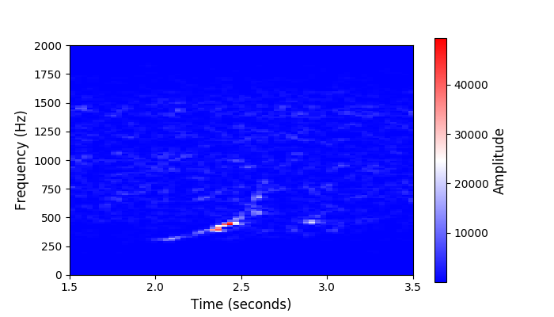
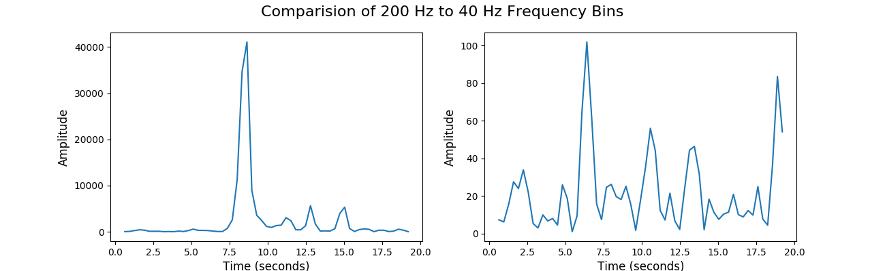

In this method, we take inspiration from [panotti repository]() and train our data.

Once we train our model, to test it out, we use test.py script with the name of audio file as arg.
Once our model detects whether the file has a whale call or not, we can then find where the position of whale call occured in the sample.

For this, we find from the spectrogram the frequency range where the whale call occured.

