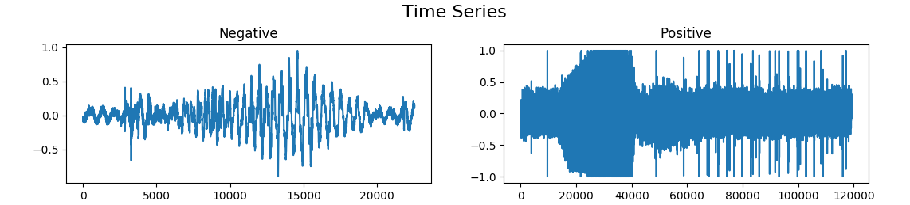
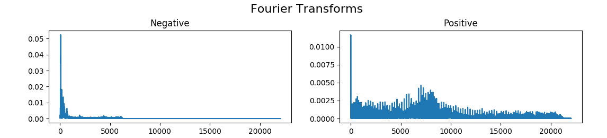
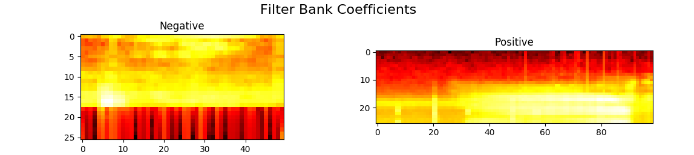
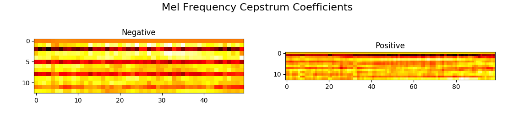

In this method, we first visualize the data and apply some preprocessing steps.
We include a csv file which has fname and label as the columns.

### Time Signal

### Fourier Transforms

### Filter Bank Coefficients

### Mel Frequency Cepstrum Coefficients

